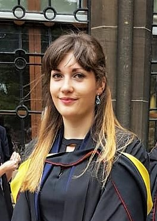

         
My name is Courtney and I am a postgraduate student in the University of Glasgow's
[Institute of Neuroscience and Psychology](http://www.gla.ac.uk/researchinstitutes/neurosciencepsychology/).
I am currently working towards my MSc in Research Methods of Psychological Science with  [Professor Lawrence Barsalou](http://barsaloulab.org/lab-members/lawrence-barsalou/). For more information on our current research project click [here](projects.html).

## Background
I completed my BSc Hons Psychology at the University of Glasgow in 2017 and achieved a First. Throughout my undergraduate degree, I developed a broad scope of knowledge for psychology. I also developed more detailed knowledge in areas of interest to me, particularly clinical psychology. 

I chose to return to Glasgow University as a postgraduate to obtain the MSc in Research Methods of Psychological Science. This has allowed me to further develop and hone my research skills as well improving  my fluency with R coding. It has also given me the platform to conduct research in a field I am passionate about.

##Research Interests

* Clinical Psychology
    * Body-focused repetitive behaviour (BFRB)
    * Shame experienced in mental health conditions
    * Dementia
* Health Pyschology
    * Healthy eating
    * Mindfulness
    * Stress Reduction

##Contact
<i class="fa fa-envelope" aria-hidden="true"></i>  2073016t@student.gla.ac.uk

